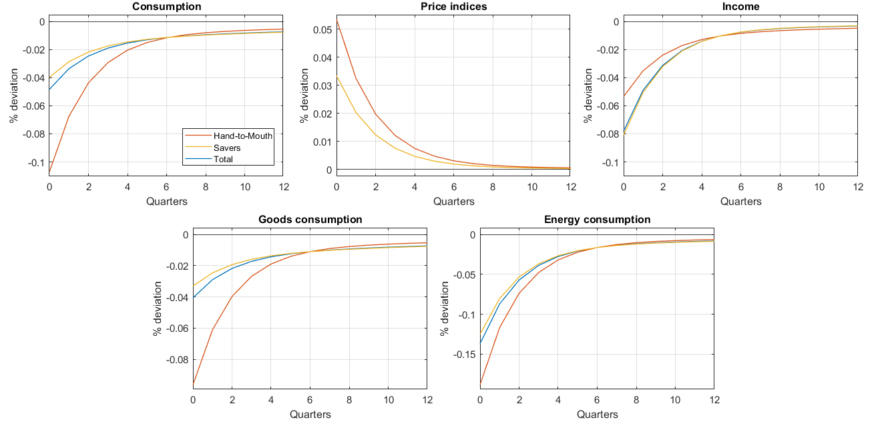
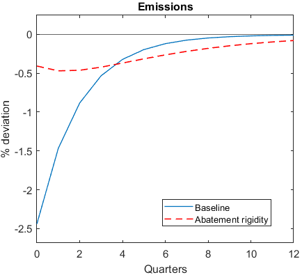
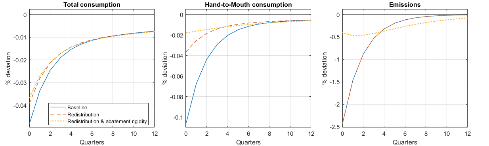

# The Uneven Macroeconomic Effects of Carbon Markets

I present a macroeconomic assessment of the distributional impacts of carbon markets. Using a DSGE model with household heterogeneity calibrated to European Union data, I show that while carbon markets are effective in reducing emissions, an increase in the carbon price reduces production and wages and raises energy prices. Low-income households bear a disproportionate share of this burden, and both higher energy expenditures and lower labour income effects contribute to the gap in consumption response between household groups. Redistributing carbon revenues effectively offsets these uneven impacts
without weakening emission reductions. Finally, I estimate that the share of revenues from the European carbon market allocated to supporting vulnerable households falls short of what would be needed to equalize the economic impact across households.

## Repository Structure
 
```
├── code/
│   ├── model_thesis.mod     # Dynare model (DSGE with climate block)
│   └── *.ipynb              # Python notebooks (data analysis & figures)
├── data/                    # Eurostat Household Budget Survey & emissions data
├── Graphs/                  # All figures used in the paper
└── Uneven_macro_effects_of_carbon_markets.pdf      # Final report
```

## Model
 
The model is a Real Business Cycle DSGE with two household types (savers and hand-to-mouth), two production sectors (energy and non-energy), and a carbon market block. Firms must purchase emission allowances and can abate emissions at a convex cost. The model is calibrated to EU data at a quarterly frequency.

# Results 
 Effects of a 1% icrease in carbon prices: 
| Finding | Value |
|---|---|
| Consumption decline — hand-to-mouth households | −0.11% |
| Consumption decline — savers | −0.04% |
| Share explained by income incidence heterogeneity | ~2/3 |
| Revenue redistribution needed to equalise impacts | 18% |
| Share currently allocated via EU Social Climate Fund | 10–15% |







## Requirements
 
- [Dynare](https://www.dynare.org/) ≥ 5.0
- Python ≥ 3.10 

## Main References
 
- Känzig, D. R. (2023). *The Unequal Economic Consequences of Carbon Pricing*. NBER WP 31221.
- Golosov, M. et al. (2014). *Optimal Taxes on Fossil Fuel in General Equilibrium*. Econometrica.
- Barrage, L. (2019). *Optimal Dynamic Carbon Taxes*. Review of Economic Studies.
